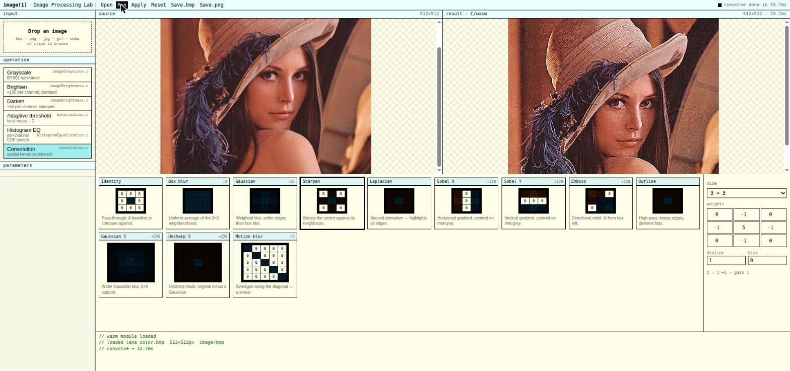
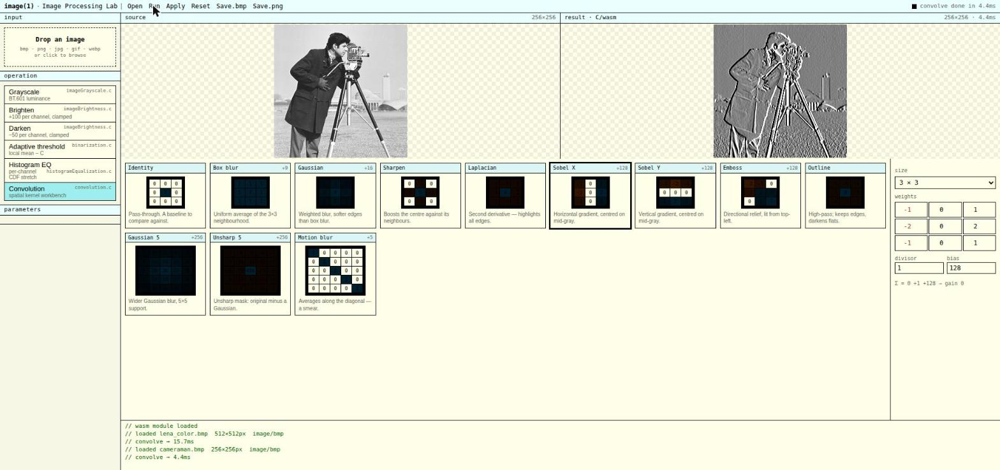
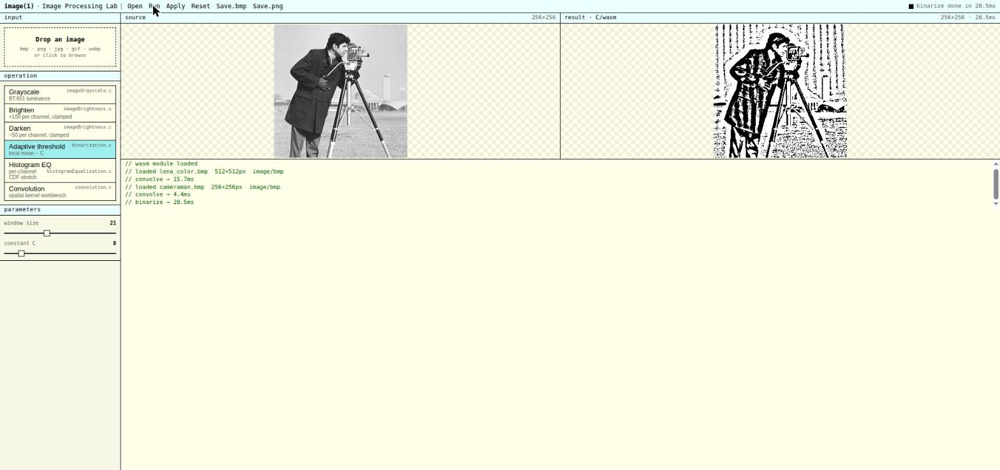
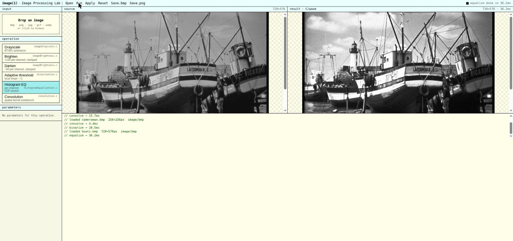

# Image Processing Algorithms in C (Compiled to WebAssembly)
---
This repository contains a collection of fundamental image processing algorithms implemented in pure C and compiled to WebAssembly using Emscripten.

The project focuses on low-level image manipulation, manual memory management, and performance-oriented pixel processing without relying on external image processing libraries.

## Overview

The codebase includes implementations of grayscale conversion, brightness adjustment, global and adaptive binarization, histogram-based correction, and a generic 2D discrete convolution engine capable of handling custom signed kernels of arbitrary size.

All algorithms operate directly on raw image buffers, demonstrating pointer arithmetic, structured memory handling, and efficient traversal of pixel data.

## Interactive Web Lab

A single-page front end (`docs/index.html`) drives the compiled WebAssembly module directly in the browser. It accepts common image formats (BMP, PNG, JPEG, GIF, WebP), converts them to the raw buffers the C engine expects, and shows the source and the C/WASM result side by side. The kernel workbench exposes a gallery of named masks — each rendered as a preview matrix with its divisor and bias — alongside a fully editable grid so custom kernels can be tried live.

| Sharpen (color convolution) | Sobel X (edge gradient, +128 bias) |
| --- | --- |
|  |  |

| Adaptive threshold | Histogram equalization |
| --- | --- |
|  |  |

## Convolution Engine

A fully generic 2D convolution implementation supports dynamic kernel dimensions and signed integer masks. This allows the application of common filters such as blur, sharpening, edge detection, and custom user-defined effects.

The implementation correctly handles boundary conditions and clamps output values to valid 8-bit ranges.

## Histogram Processing

Histogram-based correction methods are included to enhance brightness and contrast distribution across images. These operations are performed directly over pixel intensity values for full control of transformation behavior.
